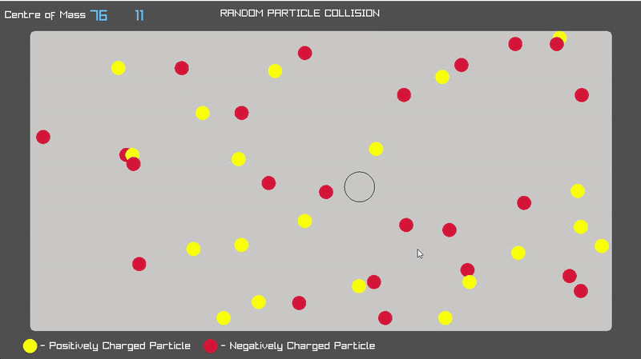

# ParticleCollision

A simple interactive particle simulation written in C++ using [raylib](https://www.raylib.com/). This project visualizes particle collisions in a 2D bounded environment, simulating basic interactions based on charge and velocity with real-time visualization.

## Features

- **Interactive Particle Creation:**  
  Click with the mouse to add a new particle at the cursor location, up to a set maximum.
- **Charge Simulation:**  
  Each particle is assigned a random charge (positive or negative), affecting how particles interact.
- **Collision Handling:**  
  Particles bounce off each other and the boundaries, swapping velocities on collision.
- **Center of Mass Visualization:**  
  The center of mass of all particles is calculated and displayed dynamically.


## Demo

 

## Getting Started

### Prerequisites

- **C++ Compiler** (C++11 or later recommended)
- **raylib** library (and its dependencies)

#### On Ubuntu

```bash
sudo apt-get install libraylib-dev
```

#### On Windows/Mac

See [raylib installation instructions](https://github.com/raysan5/raylib#installation).

### Building

Clone this repository and build using your preferred C++ build system. For example, using CMake.

```bash
mkdir build && cd build
cmake ..
make
./ParticleCollision
```

## Usage

- **Left Mouse Click:** Add a new particle at the mouse position.
- **Particles:**  
  - Yellow: Positively charged  
  - Red: Negatively charged
- **Center of Mass:**  
  - Marked with a black circle and labeled at the top left.

## Code Overview

All main logic is in `Source.cpp`.  
- Particle positions, velocities, and charges are managed with `std::vector`.
- Particle interactions are calculated in each frame (attraction/repulsion based on charge, velocity swaps on collision).
- Drawing and UI use raylib's simple API.

## License

MIT License

## Acknowledgments

- Inspired by basic physics particle simulations.
